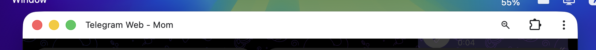
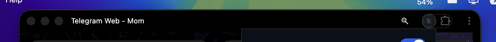

# Paint PWA

Configure any PWA default theme color base on OS color scheme.

## 🛠️ Code Conventions & Design Rules
This project follows strict styling and design guidelines to maintain modularity and maintainability.
- View and logic conventions, unit tests, and layout restrictions are documented in detail inside the [Code Convention Document](file:///Users/rinn7e/projects/rinn7e-technology/dark-pwa-extension/docs/code-convention.md).
- Workspace rules are enforced via the [.agents/AGENTS.md](file:///Users/rinn7e/projects/rinn7e-technology/dark-pwa-extension/.agents/AGENTS.md) file.

---

### The Goal
This extension is specifically designed to fix a common issue in other extensions (like colorful PWA extensions) where **restarting the PWA does not automatically apply the black title bar** until you manually click on the extension icon again. By injecting at `document_start` and monitoring the DOM with a robust `MutationObserver`, this extension ensures the black title bar is applied instantly and persistently from the very first frame without requiring any user interaction.

### Behavior
- **Global Toggle (Master Switch):** Turns all extension functionality ON or OFF globally. When turned OFF, the extension is completely deactivated and does nothing on any website.
- **Each Website Setting (Domain-specific controls):**
  - **Dark Mode Overwrite:** When enabled, forces a custom dark theme color (default: `#000000`) and dynamically overrides any attempts by the page's SPA framework to reset it.
  - **Light Mode Overwrite:** When enabled, forces a custom light theme color (default: `#ffffff`) to override the title bar color in light mode.
- **Font Size Configuration:** Dynamic adjustment of the root font size from `12px` to `32px` using `[-]` and `[+]` selectors in the footer. The popup dimensions remain static, while the UI content scales proportionally.
- **Backup & Portability (Export/Import):** Backup settings by exporting configuration to a local JSON file (`paint-pwa-backup.json`), and easily import them back with full `io-ts` runtime schema validation.
- If domain settings or their individual mode toggles are disabled, the extension does not apply overrides for that mode, allowing the site's default developer-set theme color to render naturally.

---

## Screenshots

### Settings Popup UI


### Before & After Comparison

#### Before (Original Title Bar)


#### After (Forced Black Title Bar)


---

## Getting Started

### 1. Install Dependencies

Install dependencies using `pnpm`:

```bash
pnpm install
```

### 2. Set Up Environment Variables

Copy the example environment file to configure your local environment settings:

```bash
cp .env.example .env.development
# and/or
cp .env.example .env.production
```

### 3. Build

Compile production bundles for Chrome, Firefox, and Safari:

```bash
pnpm run build
```

The build scripts output compiled extension bundles to `./dist/chrome`, `./dist/firefox`, and `./dist/safari` containing browser-specific manifests and assets.

### 4. Development Build

Compile development bundles for Chrome, Firefox, and Safari (which load `.env.development` variables and preserve source maps, without zipping):

```bash
pnpm run build:dev
```

### 5. Running Tests

Run all unit tests using Vitest:

```bash
pnpm run test
```

---

## Environment Variables

The project loads configurations from environment files based on the build target mode (`.env.development` or `.env.production`). These files are ignored by git to protect local preferences.

To set up your environment variables:

1. Copy the example environment file:
   ```bash
   cp .env.example .env.development
   # and/or
   cp .env.example .env.production
   ```
2. Configure the variables as desired inside the newly created files:

| Variable Name            | Description                                                                                                   | Default / Example Value      |
| :----------------------- | :------------------------------------------------------------------------------------------------------------ | :--------------------------- |
| `VITE_DISABLE_LOG`       | Strips all `console.*` (log, warn, error, info, debug) calls from compiled bundles if set to `true`.          | `true` (prod), `false` (dev) |
| `VITE_SHOW_BUILD_DATE`   | Displays the formatted date/time of the build under the extension title in the popup header if set to `true`. | `true`, `false`              |
| `VITE_DEFAULT_FONT_SIZE` | Defines the default root font size in pixels (e.g. 16) for scaling the extension's popup UI.                  | `16`                         |

---

## Installation

### Manual Installation

If you prefer to compile and install the extension yourself, follow these steps:

#### 1. Build from Source

Ensure you have [Node.js](https://nodejs.org/) and [pnpm](https://pnpm.io/) installed.

```bash
pnpm install
pnpm run build
```

This compiles the extension code and outputs target directories:
- `./dist/chrome` for Chrome and Chromium-based browsers.
- `./dist/firefox` for Firefox.
- `./dist/safari` for Safari.

#### 2. Load the Extension into Your Browser

##### For Chrome and Chromium-based Browsers (Brave, Edge, Vivaldi, Opera)

1. Open the browser and navigate to `chrome://extensions/`.
2. Enable **Developer mode** using the toggle in the top-right corner.
3. Click the **Load unpacked** button in the top-left corner.
4. Select the `./dist/chrome` directory from this project.

##### For Firefox

1. Open Firefox and navigate to `about:debugging#/this-firefox`.
2. Click **Load Temporary Add-on...**
3. Select the `manifest.json` file inside the `./dist/firefox` directory.

##### For Safari

1. Ensure the **Develop** menu is enabled in Safari (`Safari` > `Settings` > `Advanced` > `Show Develop menu in menu bar`).
2. Build the Xcode project wrappers using Safari Web Extension tools (configured via your script/templates).

---

## License

This project is licensed under the GNU General Public License v3.0. See the [LICENSE](LICENSE) file for details.
