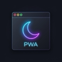
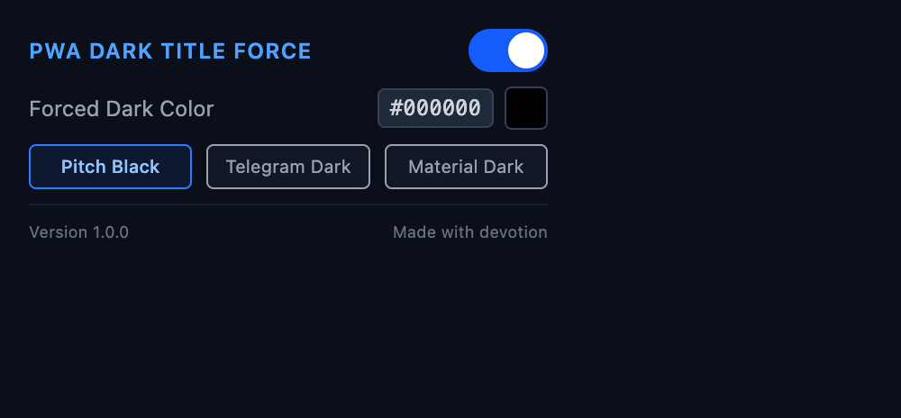

# PWA Dark Title Bar Color Force

A lightweight browser extension designed to force a theme-appropriate title bar color for Progressive Web Apps (PWAs). 

### The Goal
This extension is specifically designed to fix a common issue in other extensions (like colorful PWA extensions) where **restarting the PWA does not automatically apply the black title bar** until you manually click on the extension icon again. By injecting at `document_start` and monitoring the DOM with a robust `MutationObserver`, this extension ensures the black title bar is applied instantly and persistently from the very first frame without requiring any user interaction.

### Behavior
- **Dark Mode:** Forces a solid black theme color (`#000000`) and dynamically overrides any attempts by the page's SPA framework to reset it.
- **Light Mode:** Does nothing (and restores/removes any dark mode override if transitioning back to light mode) to leave the site's default behavior completely untouched.

Matches the development and build patterns of [damn-center-extension](https://github.com/rinn7e/damn-center-extension). Built with **Vite**, **TypeScript**, and **ESLint**.

## Screenshot



---

## Getting Started

### 1. Install Dependencies

Install dependencies using `pnpm`:

```bash
pnpm install
```

### 2. Build

Compile production bundles for Chrome, Firefox, and Safari:

```bash
pnpm run build
```

The build scripts output compiled extension bundles to `./dist/chrome`, `./dist/firefox`, and `./dist/safari` containing browser-specific manifests and assets.

### 3. Development Build

Compile development bundles for Chrome, Firefox, and Safari (which preserve source maps and do not zip the output):

```bash
pnpm run build:dev
```

---

## Installation

### Manual Installation

If you prefer to compile and install the extension yourself, follow these steps:

#### 1. Build from Source

Ensure you have [Node.js](https://nodejs.org/) and [pnpm](https://pnpm.io/) installed.

```bash
pnpm install
pnpm run build
```

This compiles the extension code and outputs target directories:
- `./dist/chrome` for Chrome and Chromium-based browsers.
- `./dist/firefox` for Firefox.
- `./dist/safari` for Safari.

#### 2. Load the Extension into Your Browser

##### For Chrome and Chromium-based Browsers (Brave, Edge, Vivaldi, Opera)

1. Open the browser and navigate to `chrome://extensions/`.
2. Enable **Developer mode** using the toggle in the top-right corner.
3. Click the **Load unpacked** button in the top-left corner.
4. Select the `./dist/chrome` directory from this project.

##### For Firefox

1. Open Firefox and navigate to `about:debugging#/this-firefox`.
2. Click **Load Temporary Add-on...**
3. Select the `manifest.json` file inside the `./dist/firefox` directory.

##### For Safari

1. Ensure the **Develop** menu is enabled in Safari (`Safari` > `Settings` > `Advanced` > `Show Develop menu in menu bar`).
2. Build the Xcode project wrappers using Safari Web Extension tools (configured via your script/templates).
